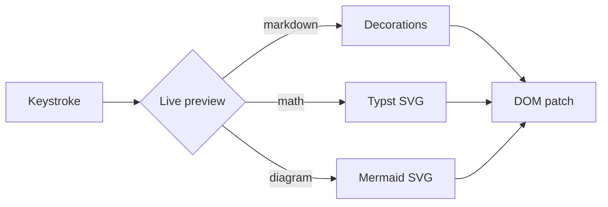

# Rendering Test

Every block the guide can contain, on one page, so a change to the renderer shows itself here before it shows itself in a chapter.

This is the editor's own playground document. The guide is rendered by the editor's markdown pass, so what you see here is what the editor shows while you write.

> [!warning] This page is a fixture
> It is deliberately strange. Nothing here is advice about writing charts; it exists to be looked at.

## Headings

Setext-style heading too
========================

Subtitle via dashes
-------------------

## Inline styles

**bold**, *italic*, ***bold italic***, ~~strikethrough~~, \
==highlight==, `inline code`, and an inline footnote^[click the marker to edit me].

Links: standard [Anthropic](https://anthropic.com), \
an autolink <https://obsidian.md>, \
wikilinks: [[introduction|An Introduction]], [[header|the Header chapter]], \
and to a header [[chords|Chords]]. Unresolved targets render red \
(no vault yet, so every wikilink is unresolved). \
Tags like #editor #live-preview #notes/howto, \
and a footnote ref [^1]. \
Block id at end of paragraph ^demo-block-id

## Block styles

> Blockquotes are just blockquotes.
> Multi-line works too.

- Unordered list item
- Another item

1. Ordered list
2. Stays numbered

- [ ] Click the checkbox to toggle
- [x] Done
- [/] In progress (custom Tasks-plugin status)
- [>] Forwarded
- [-] Cancelled

### Callouts (all 13 types)

> [!note] Note
> Callouts share the blockquote syntax.

> [!tip] Tip
> Press `/` anywhere to open the slash-command menu.

> [!warning]+ Collapsible warning
> The `+`/`-` on the type marker controls folded default.

> [!danger] Danger
> High-stakes call-out style.

> [!info] Info
> Use the slash menu `/callout` to insert any of the others — \
abstract, info, success, question, failure, bug, example, quote.

> [!example] Nested callouts
> The outer is an example callout.
> > [!warning] Two levels deep
> > The body inherits the inner kind.
> > > [!danger] Three levels
> > > Rare in practice but supported.
> Back to the outer level.

### Table

| Feature             | Status        | Notes                          |
|---------------------|---------------|--------------------------------|
| Headings (1-6)      | ✅ Mod-1..6   | Mod-0 strips                   |
| Tables              | ✅            | GFM pipe form                  |
| Math (inline+block) | ✅ Typst      | Compiled per-pass via cache    |
| Mermaid             | ✅ pure Rust  | mermaid-rs-renderer            |
| Frontmatter         | ✅ editable   | bool/number/date/list/text     |
| Vim                 | ✅ default-on | C/D/Y / gg / gu/gU/g~ / */#/n  |
| Slash menu          | ✅ `/` opens  | `/callout`, `/typst`, …        |

### Math

Inline math compiles via Typst: $E = m c^2$, and a longer one — \
$sum_(i=1)^n i = n(n+1)/2$.

$$ integral_0^1 x^2 d x = 1/3 $$

### Typst block

```typst
= Typst block heading

Full Typst documents render in-place.

$ A = mat(1, 2; 3, 4) $
```

### Mermaid diagram



### Editor commands

- **Mod-B** / **Mod-I** — bold / italic
- **Mod-K** — wrap as `[…](url)`
- **Mod-L** — cycle list marker (none → `-` → `1.` → `- [ ]`)
- **Mod-T** — toggle task on current line
- **Mod-1**..**Mod-6** — heading levels; **Mod-0** strips
- **Mod-E** — toggle reading mode
- **`/`** — open the slash-command palette

### Embeds

Wikilink embed: `![[chart.svg|320]]` (renders an `` when the file resolves).

### Block IDs (Logseq-style references)

This is a referenceable block — press Mod-Shift-K on any block to give it an id.
id:: 5f9c1234-abcd-4ef0-8123-fedcba012345

You can reference it inline like this: ((5f9c1234-abcd-4ef0-8123-fedcba012345)).

Or embed the whole block as a card:

{{embed ((5f9c1234-abcd-4ef0-8123-fedcba012345))}}

### Page + section embeds (Obsidian-style)

Embed a whole page (placeholder until multi-file lookup):

![[header]]

Embed a section by heading — resolves intra-doc if the heading lives in this file:

`![[#Math]]`

Embed a block by Obsidian short-id (the `^demo-block-id` anchor near the top):

`![[#^demo-block-id]]`

### Code fences (syntax highlighting)

```rust
fn greet(name: &str) -> String {
    format!("Hello, {name}!")
}
```

```python
def greet(name):
    return f"Hello, {name}!"
```

```ts
const greet = (name: string) => `Hello, ${name}!`;
```

Comments like %% this %% hide on focus-away.

---

[^1]: Footnote definitions live at the bottom of the file.

Markers stay visible while your caret is on the span — move away and they fade out.

---

Up: [[introduction|An Introduction]]
